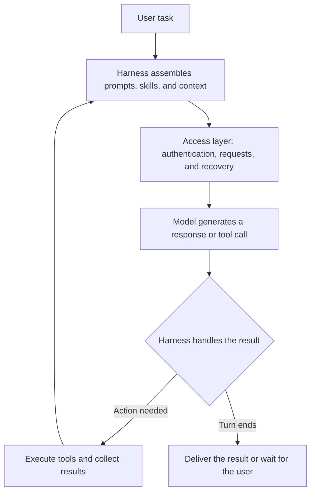

<BilibiliVideo bvid="BV1CgYd6UERj" />

[Watch the video on Bilibili](https://www.bilibili.com/video/BV1CgYd6UERj/)

<TOCInline fromHeading={1} toHeading={2} toc={props.toc} />

Recently, while using GPT models through OpenCode, we encountered tasks that stopped midway and needed another request to continue. Work felt smoother when using Codex directly, especially when handling several tasks at once.

Our third-party setup reused local authentication information and reached the backend through an adapter or proxy. Differences between the two setups could therefore come from the request path, the client, or the task execution logic. This experience is not enough to establish which product is more stable overall. It did, however, draw our attention to something that model selection often overlooks: **choosing a model also means choosing a harness to run it.**

The harness has two jobs. It must keep tasks running reliably, sustaining the required concurrency without excessive delay. It must also provide suitable prompts, tools, and context so that the model can do the work well. We reviewed public material on tool post-training, prompt adaptation, and harness comparisons to understand these two dimensions of performance.

_Sources reviewed through September 12, 2026. This article combines our observations with public evidence; we have not conducted a controlled performance comparison between Codex and OpenCode._

## The Harness Determines How the Model Works

In an agent system, the harness is the set of mechanisms built around the model. It assembles the system prompt, loads skills, exposes tools, executes the model's actions, preserves context, and decides whether to continue to another turn.

Consider a code change. The model requests a file, calls a tool to edit it, and runs tests. If a test fails, it must use that result to make another correction. The harness connects these steps. It helps determine how file contents are presented, how tool results are returned, and which information carries into the next turn.

Changing the harness can leave the model weights untouched while changing how the model receives information and takes action. We divide the resulting effects into **availability** and **task performance**: whether work can keep running, and how well the model does the work once it is running.

The two also interact. A malformed tool call consumes extra requests. If recovery from an interruption loses context, the model may repeat work it has already done. Both problems eventually appear in completion time, output quality, and the number of times a person has to intervene.

## Availability Means Keeping Tasks Running to Completion

To understand the interruptions we saw, we first need to identify the request path. OpenCode supports both ChatGPT account sign-in and OpenAI API keys; Codex also supports subscription sign-in and API keys. The client name alone does not tell us which endpoint, quota system, or proxy path is in use. Our configuration was only one possible combination. [OpenCode Providers](https://opencode.ai/docs/providers/#openai), [Codex authentication documentation](https://learn.chatgpt.com/docs/auth)

Authentication provides access. Continuous operation also requires handling streaming responses, tool call events, connection timeouts, rate limits, retries, and session state after an interruption. How an adapter handles these details directly affects the experience. Connection reuse and automatic recovery can reduce waiting, while an error parsing a particular event can terminate the task.

An OpenCode issue provides a relevant example. In April 2026, a user reported that in version 1.4.3, some stream-reading errors and wrapped rate-limit or concurrency errors did not enter the expected retry path, causing tasks to terminate. This is a report about a historical version that we have not reproduced. It nevertheless describes a concrete failure mechanism: a temporary upstream error can become an interruption requiring human intervention when the client does not recognize it correctly. [OpenCode issue #21893](https://github.com/anomalyco/opencode/issues/21893)

Similar-looking pauses in the interface can originate at different stages. A failed request calls for an investigation of transport and recovery. A tool or subagent that never returns calls for an execution-state check. If the model ends its turn normally before completing the task, the prompt and stopping logic need attention. Distinguishing these cases tells us where to look next.

Running several tasks at once places more load on the request path. Opening multiple sessions, sending concurrent model requests, and executing tools in parallel within one task are separate forms of concurrency with different constraints. OpenAI's public API, for example, has limits on requests and tokens per minute, with allowances that depend on factors such as the model and account usage tier. Those allowances cannot simply be applied to subscription access. [OpenAI rate limits](https://developers.openai.com/api/docs/guides/rate-limits)

We therefore care more about **effective throughput: how many tasks meet their acceptance criteria per unit of time**. If higher concurrency also increases queuing, retries, and requests from the user to resume work, it may not produce more completed work. Latency should likewise cover the full interval from task submission to a usable result, including tool execution and recovery.

Our current preference for Codex comes from this experience of continuous work. Whether it can sustain a higher concurrency limit, and by how much, still needs to be measured with fixed access conditions and tasks.

## Tool Interfaces Affect How Well the Model Performs

Even when requests remain healthy, a model's performance can change with the harness. Our initial hypothesis concerned the tool environment used during training: if a model has learned a particular way of operating, a similar interface may help it apply those capabilities.

OpenAI's public documentation supports this idea. The official GPT-5.2 guide explicitly states that the model was post-trained for specific tools. Using `apply_patch` as an example, it reports that an implementation using freeform calls reduced tool failure rates by **35%** in testing. This figure describes a reduction in tool failures. It does not mean a 35-percentage-point increase in task success, nor does it measure the performance gain of the Codex product as a whole. [GPT-5.2 tool-use guide](https://developers.openai.com/api/docs/guides/latest-model?model=gpt-5.2)

Editing a file can mean generating the entire replacement file, producing a patch, or calling a structured editing operation. Each interface changes what the model must generate, where errors are likely to occur, and what feedback it receives after an error. Adaptation therefore includes parameter formats, execution semantics, and returned content. The tool name is only a small part of it.

The Codex guide specifically recommends reusing the official `apply_patch` implementation because the model was trained on that patch format. It also allows different implementations for operations such as reading files, while noting that other custom tools may require more tuning. [Codex Prompting Guide: Tools](https://developers.openai.com/cookbook/examples/gpt-5/codex_prompting_guide#tools)

This adaptation extends to conversation state. For GPT-5.3-Codex, the same guide requires integrations to preserve the assistant message's `phase`, which distinguishes progress commentary from a final answer. Dropping it when reconstructing conversation history can cause behavior such as premature stopping and significantly affect performance. A field that is absent from the visible chat text can still influence whether the model continues until the work is done. [Codex Prompting Guide: Phase](https://developers.openai.com/cookbook/examples/gpt-5/codex_prompting_guide#phase)

Differences in tool environments can also appear in task completion rates. The SWE-agent paper at NeurIPS 2024 compared operating environments using the same GPT-4 Turbo model on 300 SWE-bench Lite tasks. The full SWE-agent system resolved **18.0%**, compared with **11.0%** for a shell-only version with demonstrations. The difference reflects the overall interface and supporting design, including editing, browsing, feedback, and context management. It cannot be attributed entirely to a single tool. [SWE-agent paper, Tables 1 and 3](https://papers.neurips.cc/paper_files/paper/2024/file/5a7c947568c1b1328ccc5230172e1e7c-Paper-Conference.pdf)

This evidence explains why tool compatibility deserves attention. We did not find a public controlled study that supports the broader claim that the complete Codex toolset is optimal for every GPT model.

## Prompts and Skills Need to Evolve with the Model

Tools define the actions a model can take. System prompts and skills guide how it organizes those actions. Changing them can improve results or add friction.

Providing a project's build commands, directory conventions, and acceptance criteria can reduce exploration. Requiring extensive reading of unrelated documentation before every small edit adds work. Instructions to both “complete the task autonomously” and “stop for confirmation at every step” may also cause a task to end earlier than intended. These changes affect the rules the model follows while executing the task.

Skills can supply workflow knowledge, reference material, and scripts, but that content needs to enter the context at the right time. Their value depends on whether the model selects the right skill, how much it must read, and whether the prescribed steps apply to the task.

OpenAI's guidance on GPT-6 Astra prompts and skills, published on September 11, 2026, addresses this issue. Long or conflicting skill descriptions can interfere with selection, while detailed procedures accumulated for older models may constrain newer ones. It recommends loading content as needed and reviewing which rules in `AGENTS.md` are still necessary. The guidance does not establish a universal degradation rate. It does remind us that configurations that worked before need to be reevaluated as models change. [Rethinking skills and prompts for GPT-6 Astra](https://developers.openai.com/blog/rethinking-skills-and-prompts-for-gpt-6-astra)

For longer tasks, the harness must also decide how to compact history. If compaction omits user constraints, unresolved failures, or completed actions, the next turn starts from an incomplete state. Anthropic's article on context engineering discusses prompts, tools, history, and compaction together. It also recommends starting with the minimum necessary information and adding content in response to observed failures. [Effective context engineering for AI agents](https://www.anthropic.com/engineering/effective-context-engineering-for-ai-agents)

These concerns connect with our earlier experience [rewriting iKanban with DeepSeek Harness](/en/blog/tools/deepseek-harness-ikanban). [DSH's plugin architecture](https://github.com/deepseek-ai/deepseek-harness) lets us combine and replace parts of the runtime. That flexibility gives us room to experiment while making us responsible for validating the configuration.

After changing a system prompt, skill, or tool, we therefore need to ask which failure it addresses, whether it introduces new errors, and how much execution cost it adds. Those answers tell us whether the customization helps.

## Establish a Baseline with the Native Harness

Returning to our original choice, we would start with Codex as a baseline for coding work with GPT models. It offers tools and execution mechanisms we can refer to, along with model-specific integration guidance. Our own experience also supports starting there.

Any advantage of the native environment still needs to be verified on concrete tasks. In February 2026, METR held GPT-5 and Claude Opus 4.5 fixed in separate comparisons of Codex with Triframe and Claude Code with ReAct. Neither comparison showed a statistically significant difference in time horizon: the task length, measured in human completion time, at which the model succeeds **50%** of the time. The native harnesses did not show a clear advantage in this experiment, but the results are also insufficient to establish complete equivalence. The evaluation used tasks without human interaction, and the GPT-5 model tested was not GPT-5-Codex. [METR: Measuring Time Horizon using Claude Code and Codex](https://metr.substack.com/p/2026-02-13-measuring-time-horizon-using-claude-code-and-codex)

Based on the mechanisms discussed above, we infer that a third-party harness could achieve similar results if it preserves the necessary tool semantics and context state. Adding domain tools that a task actually needs could also improve performance. The useful comparison is between specific combinations of model, configuration, and task.

This leaves several options for custom workflows. For example, OpenAI's App Server interface lets products integrate Codex authentication, session history, and streaming agent events. Developers can build their own interactions while reusing Codex's execution capabilities, checking the documented maturity of each feature before adopting it. [Codex App Server](https://learn.chatgpt.com/docs/app-server)

For our workflow across multiple projects and sessions, we can design window organization and keyboard shortcuts separately while reusing existing implementations for tool execution and session continuity. Identifying the layer that needs to change helps control the cost of adaptation.

## How to Evaluate Harness Fit

Our next step is to compare complete workflows, then isolate the sources of any differences.

To compare everyday use of Codex, OpenCode, or DSH, we can keep each one's access method and default tools and observe which combination completes tasks more reliably. To explain the results, we need to fix the model version, reasoning effort, task budget, starting code, and runtime environment, then change the prompt, tools, or request path one at a time. When identical model versions or backend deployments cannot be confirmed, they should be recorded as uncontrolled variables.

We will track the following outcomes across availability and task performance, together with the cost of achieving them:

| Dimension               | What to record                                                                                                 | What it helps answer                                             |
| ----------------------- | -------------------------------------------------------------------------------------------------------------- | ---------------------------------------------------------------- |
| Availability            | Request errors, retry counts, interruption recovery rate, and the share of tasks requiring manual continuation | Why do tasks stop, and can they recover on their own?            |
| Concurrency and latency | Effective throughput at each concurrency level, median task duration, and P95 duration                         | Does higher concurrency produce more completed work?             |
| Task performance        | Completion rate under the same acceptance criteria, tool errors, missed constraints, and rework                | When requests work normally, is the result correct and complete? |
| Execution cost          | Tokens, fees, and human intervention time per successful task                                                  | Is this level of performance worth using over time?              |

Tasks should come from real work, including small edits, multiple rounds of tool use, and long tasks that cross a context-compaction boundary. Repeating the same task set and interleaving different configurations can reduce the influence of output variability and service conditions at different times. We would first compare completion quality at low concurrency, then raise the load to observe how throughput and latency change.

The records should include both the completion rate across all initiated tasks and the quality of results when requests end normally. This captures the losses caused by interruptions while helping us assess whether the model does the work correctly when the request path is healthy. Duration statistics should also include failure and timeout counts. Otherwise, a small set of fast successes could make an unreliable combination appear faster.

This gives us a more concrete way to think about model selection. We need to consider which problems a model can solve, which environment it uses to solve them, and how much waiting and intervention that process requires. Including the harness in the decision helps turn the model's capabilities into dependable work.
