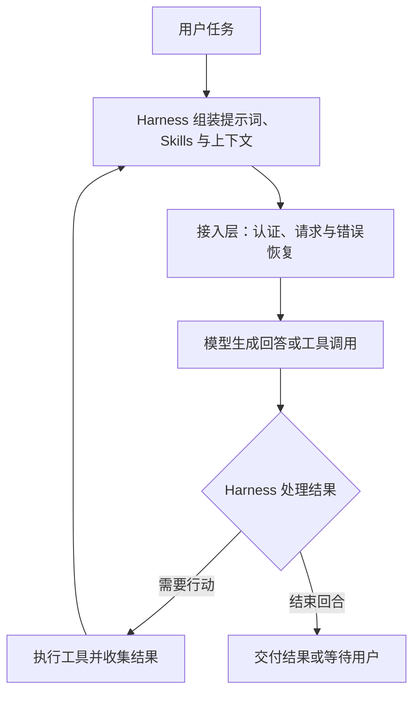

<BilibiliVideo bvid="BV1CgYd6UERj" />

[在 Bilibili 上观看视频](https://www.bilibili.com/video/BV1CgYd6UERj/)

<TOCInline fromHeading={1} toHeading={2} toc={props.toc} />

最近用 OpenCode 调用 GPT 模型时，我们遇到过这样的情况：任务做到一半停下来，需要再次请求才能继续。直接使用 Codex 时，整个过程感觉更连贯，尤其是同时推进多个任务的时候。

我们当时的第三方接入配置涉及复用本地认证信息，再通过适配或代理访问后端。因此，两边的差异可能同时来自请求链路、客户端和任务执行逻辑。这段经历还不足以判断哪个产品整体更稳定，却让我们注意到一个容易被模型选型忽略的问题：**选好模型之后，还要选好运行它的 Harness。**

它需要解决两件事。一是让任务稳定运行，维持可用的并发和延迟；二是给模型合适的提示词、工具和上下文，让它把任务做好。我们查阅了工具后训练、提示词适配和 Harness 对照研究，试着沿着这两条线，理解同一个模型为什么会表现得不一样。

_资料查阅截至 2026 年 9 月 12 日。本文结合使用观察与公开资料，未进行 Codex 与 OpenCode 的受控性能测试。_

## Harness 决定模型怎样参与工作

在 Agent 场景里，Harness 是围绕模型构建的一整套运行机制。它负责组装系统提示词（System Prompt）、加载 Skills、提供工具、执行模型发出的动作、保存上下文，并决定下一轮是否继续。

以代码修改为例，模型先请求读取文件，再调用工具修改代码、运行测试。如果测试报错，它还要根据结果继续修正。Harness 负责把这些步骤连起来：文件内容怎样呈现，工具结果怎样返回，哪些信息留到下一轮，都由它参与决定。

更换 Harness 时，模型权重可以保持不变，但模型获得信息和采取行动的条件已经改变。我们把它对任务的影响分成**可用性**和**能力发挥**：前者关注能否持续运行，后者关注运行起来以后能做得多好。

两者又会相互影响。工具格式错误会消耗额外调用；中断恢复如果丢失了上下文，就可能让模型重复已经做过的工作。这些问题最终都会体现在完成时间、结果质量和需要人介入的次数上。

## 可用性体现在任务能否持续完成

要理解我们遇到的中断，先得看清请求经过了哪里。OpenCode 支持 ChatGPT 账户登录，也支持 OpenAI API Key；Codex 同样支持订阅登录和 API Key。客户端名称本身，无法说明实际使用的端点、配额体系和代理路径。我们的配置只是其中一种组合。[OpenCode Providers](https://opencode.ai/docs/providers/#openai)、[Codex 认证文档](https://learn.chatgpt.com/docs/auth)

认证解决了访问问题，持续运行还需要处理流式响应、工具调用事件、连接超时、限流、重试，以及中断后的会话状态。适配层怎样处理这些细节，会直接影响体验：它可以通过连接复用和自动恢复减少等待，也可能在解析某类事件时出错，终止整个任务。

OpenCode 的公开问题记录中有一个相关例子。2026 年 4 月，一位用户针对 1.4.3 版本报告：部分流读取错误，以及经过包装的限流或并发错误，没有进入预期的重试路径，导致任务终止。这是未经我们复现的历史版本报告，但它指出了一种具体的故障机制：上游的暂时性错误，可能因为客户端没有正确识别，变成需要人介入的中断。[OpenCode issue #21893](https://github.com/anomalyco/opencode/issues/21893)

不过，界面上相似的「停下来」，也可能发生在不同环节。请求失败，要查传输与恢复；工具或子 Agent 迟迟没有结果，要查执行状态；模型正常结束了回合却没有完成任务，则要看提示词和终止判断。区分这些情况，才能知道下一步应该修哪里。

当多个任务一起运行时，请求链路还要承受更高的负载。同时打开多个会话、同时发送模型请求、在一次任务中并行执行工具，分别受到不同条件的约束。OpenAI 公共 API 就有每分钟请求数、Token 数等限制，具体额度与模型及账户使用层级等因素有关；订阅接入也不能直接套用这些额度。[OpenAI Rate limits](https://developers.openai.com/api/docs/guides/rate-limits)

因此，我们更关心**有效吞吐量：单位时间里，有多少任务能够达到验收标准**。如果增加并发后，排队、重试和人工续接也随之增加，最终完成的工作未必更多。延迟也应从发起任务一直量到结果可用，把工具执行和恢复时间一起算进去。

我们目前对 Codex 的偏好，来自这种连续工作的体验。它能维持的并发上限是否更高、差多少，还需要固定接入条件和任务后再测。

## 工具接口会影响模型的能力发挥

即使请求始终正常，模型的表现仍然可能随着 Harness 改变。我们最初猜测，这与训练时使用的工具环境有关：如果模型已经熟悉某种操作方式，保留相近的接口，可能更容易发挥它的能力。

OpenAI 的公开资料支持这一点。GPT-5.2 的官方指南明确说明，该模型针对特定工具做过后训练。指南以 `apply_patch` 为例，报告其采用自由格式调用的实现，在测试中使工具失败率下降了 **35%**。这个数字描述的是工具失败率的下降幅度，不能换算成任务成功率增加 35 个百分点，也不代表整个 Codex 产品的性能增益。[GPT-5.2 工具使用指南](https://developers.openai.com/api/docs/guides/latest-model?model=gpt-5.2)

同样是修改文件，可以让模型输出完整文件、生成补丁，或者调用结构化编辑操作。接口一变，模型需要生成的内容、容易犯错的位置，以及出错后得到的反馈，都会改变。因此，适配要落实到参数格式、执行语义和返回内容，工具名称只是其中很小的一部分。

Codex 的指南进一步建议复用官方的 `apply_patch` 实现，理由就是模型已经针对这种补丁格式接受过训练。它也允许采用不同形式的文件读取等工具，只是其他自定义工具可能需要更多调优。[Codex Prompting Guide：Tools](https://developers.openai.com/cookbook/examples/gpt-5/codex_prompting_guide#tools)

这种适配还包括对话状态。对于 GPT-5.3-Codex，同一指南要求集成方保留助手消息中的 `phase`，区分过程说明与最终回答。重建历史时丢弃它，可能引起提前停止等行为，并显著影响性能。一个没有显示在聊天文本里的字段，也可能影响模型能否继续把工作做完。[Codex Prompting Guide：Phase](https://developers.openai.com/cookbook/examples/gpt-5/codex_prompting_guide#phase)

工具环境的差异也会反映在任务完成率上。SWE-agent 的 NeurIPS 2024 论文使用相同 GPT-4 Turbo，在 300 道 SWE-bench Lite 任务上比较不同操作环境：完整 SWE-agent 的解题率为 **18.0%**，仅提供 Shell 并附带示范的版本为 **11.0%**。这一差异来自整套操作接口与配套设计，涉及编辑、浏览、反馈和上下文管理，不能全部归给某一个工具。[SWE-agent 论文，表 1 与表 3](https://papers.neurips.cc/paper_files/paper/2024/file/5a7c947568c1b1328ccc5230172e1e7c-Paper-Conference.pdf)

这些证据解释了为什么工具适配值得认真对待。至于完整 Codex 工具集合是否对所有 GPT 模型都最优，我们没有找到能支持这一概括的公开对照研究。

## 提示词和 Skills 也需要随模型调整

工具决定模型能采取什么动作，系统提示词和 Skills 则引导它怎样组织这些动作。修改它们，可能改善结果，也可能增加阻力。

补充项目的构建命令、目录约定和验收标准，可以减少探索成本。要求模型每次小修改都先阅读大量无关文档，则会增加额外工作。如果同时要求「自主完成任务」和「每一步都停下等待确认」，任务也可能比预期更早结束。这里改变的是模型执行任务时依据的规则。

Skills 可以携带工作流知识、参考资料和脚本，但这些内容需要在合适的时候进入上下文。模型能否选中正确的 Skill、需要读取多少内容、其中的步骤是否适用，决定了它能带来多少帮助。

2026 年 9 月 11 日，OpenAI 发布的 GPT-6 Astra 提示词与 Skills 建议就讨论了这个问题：过长或互相冲突的 Skill 描述会干扰选择，为旧模型积累的细密步骤也可能约束新模型。它建议按需加载内容，并重新检查 `AGENTS.md` 中哪些规则仍然必要。这份工程建议没有给出统一的退化比例，却提醒我们，过去有效的配置也需要随模型重新评估。[Rethinking skills and prompts for GPT-6 Astra](https://developers.openai.com/blog/rethinking-skills-and-prompts-for-gpt-6-astra)

到了长任务，Harness 还要决定怎样压缩历史。如果压缩后遗漏了用户约束、尚未解决的失败或已经完成的操作，下一轮就会从不完整的状态继续。Anthropic 的上下文工程文章将提示词、工具、历史信息和压缩策略放在一起讨论，也建议从必要的最小信息集出发，再针对实际失败补充内容。[Effective context engineering for AI agents](https://www.anthropic.com/engineering/effective-context-engineering-for-ai-agents)

这些问题与我们之前使用 [DeepSeek Harness 重写 iKanban](/zh/blog/tools/deepseek-harness-ikanban) 的经历相连。[DSH 的插件架构](https://github.com/deepseek-ai/deepseek-harness)让我们能够组合和替换运行环境中的各个部分。可定制性为实验提供了空间，也把验证配置的工作交给了我们。

因此，每次修改系统提示词、Skill 或工具后，我们都需要回答：它解决了哪种失败，是否引入新的错误，增加了多少执行成本。这样才能判断定制是否有用。

## 从原生 Harness 建立基线

回到最初的选择：为了发挥 GPT 的能力，我们会先用 Codex 建立基线。它提供了可参考的工具和执行机制，也有针对模型的适配指南；我们自己的使用体验支持从这里开始。

原生环境的优势仍然需要在具体任务上验证。METR 在 2026 年 2 月分别固定 GPT-5 和 Claude Opus 4.5，比较 Codex 与 Triframe、Claude Code 与 ReAct。其 time horizon 指标——模型达到 50% 成功率时，对应任务的人类完成时长——差异均未达到统计显著性。原生 Harness 在这组实验中没有显示出明确优势，但结果也不足以证明两者完全等效。实验采用无人交互任务，测试的 GPT-5 也并非 GPT-5-Codex。[METR：Measuring Time Horizon using Claude Code and Codex](https://metr.substack.com/p/2026-02-13-measuring-time-horizon-using-claude-code-and-codex)

从前面的机制推断，第三方 Harness 如果保留必要的工具语义和上下文状态，也可能获得相近效果；补充任务真正需要的领域工具，还有机会做得更好。我们要比较的，是具体模型、配置和任务组成的运行环境。

这也为定制工作流留下了不同选择。例如，OpenAI 的 App Server 接口允许产品集成 Codex 的认证、会话历史和流式 Agent 事件，让开发者在复用 Codex 执行能力的基础上设计交互；采用具体功能前，仍需确认其文档标注的成熟度。[Codex App Server](https://learn.chatgpt.com/docs/app-server)

对我们的多项目、多会话工作流而言，窗口组织和快捷键可以单独设计，模型如何调用工具、怎样维持会话，则可以复用已有实现。先确定需要改动哪一层，有助于控制适配成本。

## 怎样判断一个 Harness 是否更适配

接下来，我们会先比较完整工作流，再定位差异的来源。

比较 Codex、OpenCode 或 DSH 的日常使用效果时，可以保留各自的接入方式和默认工具，观察哪套组合更容易完成任务。如果要进一步解释原因，就需要固定模型版本、推理强度、任务预算、代码起点和运行环境，再逐项替换提示词、工具或请求路径。无法确认模型版本或后端部署一致时，应把它们记录为未控制的变量。

围绕可用性和能力发挥，我们会记录以下结果，并核算取得这些结果的成本：

| 维度       | 应当记录什么                                           | 帮助回答的问题                         |
| ---------- | ------------------------------------------------------ | -------------------------------------- |
| 可用性     | 请求错误、重试次数、中断恢复率、需要人工续接的任务比例 | 任务为什么停下来，能否自行恢复？       |
| 并发与延迟 | 各并发档位的有效吞吐量、任务耗时中位数与 P95           | 增加并发之后，实际完成的工作是否更多？ |
| 能力发挥   | 同一验收标准下的完成率、工具错误、遗漏约束和返工       | 请求正常时，任务做得是否正确、完整？   |
| 执行成本   | 每个成功任务的 Token、费用和人工介入时间               | 这种表现是否值得长期使用？             |

任务应来自真实工作，包括短修改、多轮工具调用，以及需要跨越上下文压缩的长任务。同一批任务重复运行，交错测试不同组合，减少偶然输出和服务时段的影响。先在低并发下比较完成质量，再提高负载，观察吞吐量和延迟怎样变化。

记录时，要同时保留所有发起任务的完成率，以及请求正常结束时的结果质量。这样既能看到中断造成的损失，也能分析模型在链路正常时是否把事情做对。耗时统计还应附带失败与超时数量，避免只剩少数快速成功的样本，让不稳定的组合看起来反而更快。

我们对模型选型的看法也因此变得更具体：既要看模型能解决什么问题，也要看它通过哪套环境、以多大的等待和介入成本完成这些问题。把 Harness 一起纳入选择，才能让模型的能力稳定地进入实际工作。
